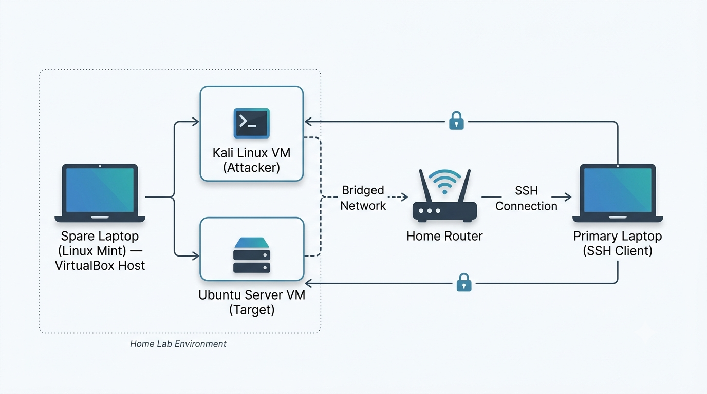

# Home Security & Automation Lab

This repository documents my hands-on progress building an active-defense security lab. The goal of this project is to simulate attacks, detect them using an Intrusion Detection System (IDS), and build automated scripts to analyze threat intelligence and block malicious IPs.

---

## Lab Architecture

| Role | OS | IP Address |
|------|----|------------|
| **Attacker VM** | Kali Linux | `192.168.x.x` |
| **Target VM** | Ubuntu Server running Suricata IDS | `192.168.x.x` |

**Network Mode:** Bridged Adapter (Connected to local home subnet)

---

## Technologies & Tools Used

**Security:** Suricata IDS, Nmap, Hydra, iptables, MITRE ATT&CK

**Languages & APIs:** Python 3, FastAPI, AbuseIPDB API, Netmiko (SSH automation)

**Infrastructure:** VirtualBox / VMware Workstation

---

## Lab Milestones

- [x] [Weeks 1–2: Virtual Network & Attack Simulation](./week-02-attacksimulation/)
- [x] [Weeks 3–4: Suricata IDS & JSON Parsing](./week-04-alert-gen-python/)
- [x] [Weeks 5–6: FastAPI & Threat Intel API Integration](./week-06-api-threat-intel/) 
- [x] [Weeks 7–8: SSH Automation & Active Defense](./week-08-active_defender_api)
- [ ] Weeks 9–12: AI MITRE Mapping & Streamlit Dashboard*(In Progress)*
