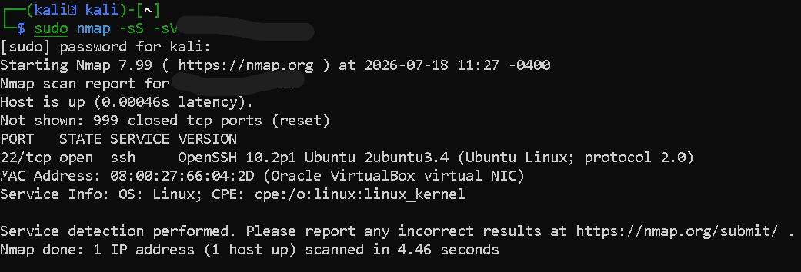
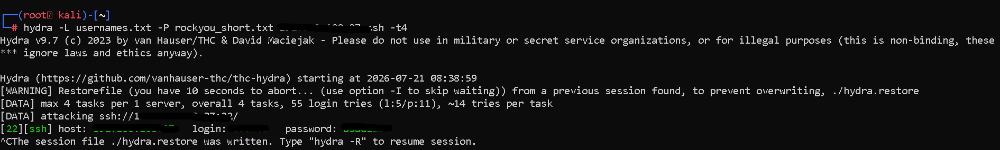

# Week 2: Attack Simulation (Nmap & Hydra)

## Objective
Simulate network reconnaissance and automated brute-force attacks from the attacker VM, while observing in real time how the target VM logs and detects these attacks.

---

## Environment

| Component | Detail |
|---|---|
| **Workstation** | Primary laptop (WSL), two terminal sessions side-by-side |
| **Attacker Terminal** | SSH into Kali VM |
| **Target Terminal** | SSH into Ubuntu Server VM (for live log monitoring) |
| **Tools Used** | Nmap, Hydra, `auth.log` |

---

## Key Steps

1. **Reconnaissance — Host Discovery** (from Kali):
   ```bash
   nmap -sn 192.168.1.0/24
   ```
   Ping sweep across the home network to identify live hosts, including the Ubuntu Server VM (Bridged mode places all VMs on the same subnet as other home devices).

2. **Targeted Port & Service Scan**:
   ```bash
   sudo nmap -sS -sV <Ubuntu_Server_IP>
   ```
   TCP SYN scan with service version detection, confirming Port 22 (SSH) open and listening.

3. **Live Log Monitoring** (on Ubuntu Server, before launching the attack):
   ```bash
   sudo tail -f /var/log/auth.log
   ```
   Streams authentication events in real time to observe detection alongside the attack.

4. **Brute-Force Attack** (from Kali):
   Custom `users.txt` / `passwords.txt` wordlists prepared, with the correct target credential seeded in.
   ```bash
   hydra -L users.txt -P passwords.txt <Ubuntu_Server_IP> ssh
   ```

---
## Screenshots




## Milestone
Hydra brute-force attack launched from Kali; corresponding "Failed password" entries observed flooding `auth.log` in real time on the Ubuntu Server VM; Hydra successfully identifies the correct credential.
