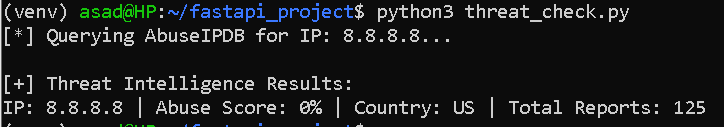

# Week 6: External APIs (The Requests Library)

## Objective
Programmatically query a third-party threat intelligence API (AbuseIPDB), manage API keys securely via environment variables, and extract threat metrics from the JSON response.

---

## Environment

| Component | Detail |
|---|---|
| **Workstation** | Primary laptop (WSL), Python virtual environment |
| **Threat Intel Source** | AbuseIPDB API (`/api/v2/check`) |
| **Libraries** | `requests`, `python-dotenv` |
| **Secrets Management** | `.env` file (key excluded from version control) |

---

## Key Steps

1. **Install Dependencies**:
   ```bash
   pip install requests python-dotenv
   ```

2. **Secure the API Key** — stored outside source code in a `.env` file:
   ```bash
   nano .env
   ```
   ```
   ABUSEIPDB_API_KEY=your_actual_api_key_here
   ```

3. **Build the Query Script** (`threat_check.py`):
   - Load the API key via `dotenv`
   - Send a GET request to `https://api.abuseipdb.com/api/v2/check`, passing the target IP as a parameter and the API key in the request headers
   - Parse the JSON response and extract `abuseConfidenceScore`, `countryCode`, and `totalReports`

---

## Screenshots
Quering ABUSEIPDB for ip address 8.8.8.8



---

## Milestone
Running the script returns live threat intelligence for a queried IP:
```bash
python3 threat_check.py
```
```
IP: 8.8.8.8 | Abuse Score: 0% | Country: US | Total Reports: 0
```
