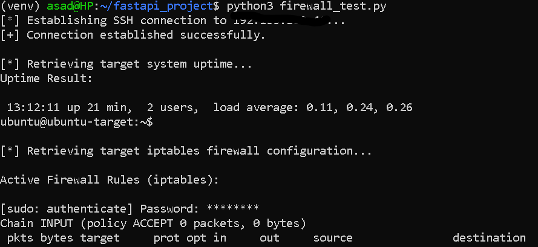

# Week 7: Network Automation (Netmiko)

## Objective
Programmatically connect to a remote Linux host via SSH using Netmiko, execute administrative commands, and query active firewall rules.

---

## Environment

| Component | Detail |
|---|---|
| **Workstation** | Primary laptop (WSL), Python virtual environment |
| **Target Host** | Ubuntu Server VM (Bridged IP) |
| **Library** | Netmiko |
| **Device Type** | `linux` |

---

## Key Steps

1. **Install Netmiko**:
   ```bash
   pip install netmiko
   ```

2. **Configure Privileged Access** — target VM's SSH user granted passwordless `sudo` for `iptables` (or sudo password handled securely in-script) to support remote firewall administration.

3. **Build the Automation Script** (`firewall_test.py`):
   - Define a device dictionary (Bridged IP, SSH credentials, `device_type: linux`)
   - Establish connection via `ConnectHandler`
   - Run a read-only validation command (`uptime`) via `send_command()`
   - Query active firewall rules: `sudo iptables -L -n -v`

4. **Manual Firewall Syntax** (prep for Week 8 automation):
   ```bash
   sudo iptables -A INPUT -s <IP_TO_BLOCK> -j DROP
   ```

---

## Screenshots


---
## Milestone
Script executed from WSL establishes an SSH connection to the Ubuntu Server VM over the home network and returns the live `iptables` rule table to the local terminal.
