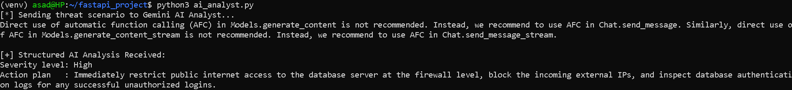

# Week 9: AI APIs & Structured Threat Analysis

## Objective
Integrate a generative AI model (Google Gemini) to automate security threat triage, enforcing strict, deterministic JSON output via Pydantic schema mapping — a foundational step toward SOAR pipeline design.

---

## Environment

| Component | Detail |
|---|---|
| **Workstation** | WSL, Python virtual environment (`~/fastapi_project`) |
| **AI Provider** | Google Gemini (`google-genai` SDK) |
| **Schema Validation** | Pydantic (`response_schema`) |
| **Secrets Management** | `.env` (`GEMINI_API_KEY`) |

---

## Key Implementation

- Defined an `AnalysisResult` Pydantic model (`severity`, `suggested_action`) to constrain AI output
- Queried Gemini via `client.models.generate_content()` with `response_mime_type: application/json` and `response_schema` enforcement
- Accessed results as a validated Python object (`response.parsed`) — no manual JSON parsing required

---

## Troubleshooting Log

| Issue | Cause | Fix |
|---|---|---|
| `404 NOT_FOUND` | `gemini-2.5-flash` deprecated | Switched to `gemini-3.6-flash` |
| `403 PERMISSION_DENIED` | Google Cloud project flagged/restricted | Generated a new API key under a clean project |
| `404 NOT_FOUND` (schema) | Legacy `gemini-1.5-flash` doesn't support `response_schema` | Reverted to `gemini-3.6-flash`, which supports structured output |

---

## Key Learnings

- **Structured output matters for automation** — freeform AI text is fragile to parse; a downstream script (e.g. the Week 8 Netmiko blocker) would break on conversational filler. Schema enforcement guarantees a reliable, machine-safe contract.
- **Error triage** — distinguished code errors, API-versioning errors (404), and account/platform-level blocks (403) as separate failure classes requiring different fixes.

---

## Milestone
Submitted a live threat scenario (anomalous connection spike on a database server) and received a structured, schema-validated response:

This lays the groundwork for automated MITRE ATT&CK-mapped alert triage in Week 10–11, replacing the hardcoded prompt with live Suricata alert data.
