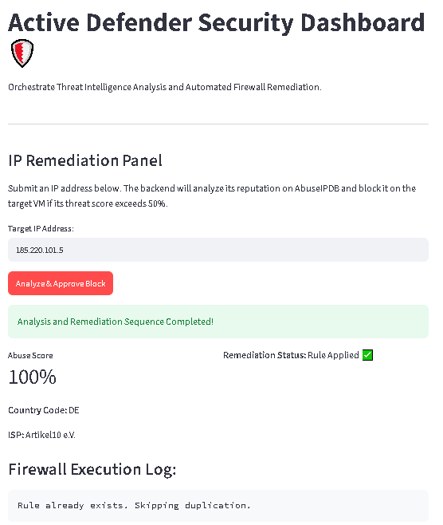
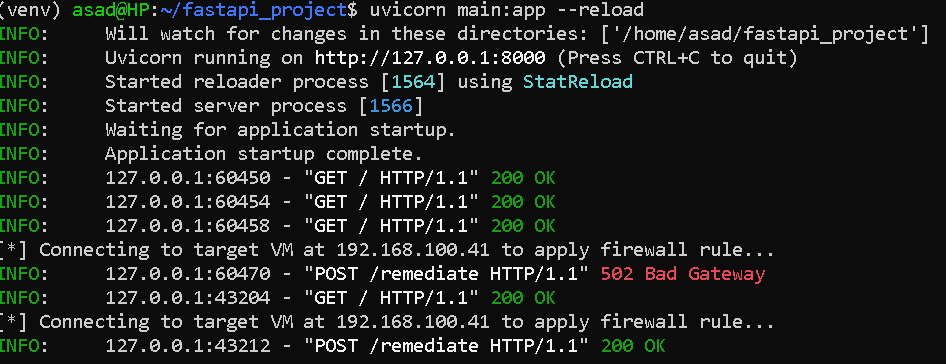

# Week 11: Frontend Prototyping (Streamlit)

## Objective
Build an interactive web dashboard in pure Python using Streamlit, and connect it to the FastAPI backend via HTTP requests — giving the automated defense pipeline a usable front end.

---

## Environment

| Component | Detail |
|---|---|
| **Workstation** | WSL, Python virtual environment (`~/fastapi_project`) |
| **Frontend Framework** | Streamlit |
| **Backend** | FastAPI (`Active Defender API`, running locally) |
| **Bridge** | Python `requests` library |
| **Access** | Windows browser → `http://localhost:8501` |

---

## Key Implementation

- Installed Streamlit:
  ```bash
  pip install streamlit
  ```
- Built `app.py` with core widgets:
  - `st.title()` — dashboard header
  - `st.text_input()` — target IP entry field
  - `st.button()` — "Approve Block" action trigger
- Connected the frontend to the backend using `requests`:
  - `GET` request to `http://127.0.0.1:8000/` to confirm the API is live
  - `POST` request to `/remediate` on button click, passing the entered IP
- Launched the dashboard:
  ```bash
  streamlit run app.py
  ```

---

## Screenshots



* **Description:** The interactive frontend dashboard built with Streamlit. It allows security operators to input a target IP (e.g., `185.220.101.5`) and execute real-time threat remediation. 
* **Key Details Shown:**
  * **Real-time Threat Intel:** Retrieves a 100% Abuse Confidence Score from AbuseIPDB, alongside geo-location metadata.
  * **Rule Deduplication:** Demonstrates the defensive `iptables` validation check in action, safely outputting `"Rule already exists. Skipping duplication."` to prevent table bloat on the remote target VM.



* **Description:** Live terminal logs of the FastAPI backend server (`uvicorn`) running inside WSL on the primary laptop, capturing the end-to-end programmatic workflow.
* **Key Details Shown:**
  * **Endpoint Traffic:** Displays standard incoming health checks (`GET /` returning `200 OK`).
  * **Error & Triage Handling:** Logs a handled backend exception (`POST /remediate` returning `502 Bad Gateway`) due to an initial SSH private key path mismatch.
  * **Successful Remediation:** Shows the successful connection, passwordless privilege escalation, and firewall rule deployment (`POST /remediate` returning `200 OK`) after implementing the secure fallback logic.
 
---
## Milestone
Streamlit dashboard runs in WSL and renders in the Windows browser at `http://localhost:8501`, successfully fetching live data from the FastAPI backend. Submitting an IP through the dashboard triggers the `/remediate` workflow on the backend in real time.

---

## Key Learnings
- **A UI isn't just cosmetic — it's a trust layer.** Being able to submit an IP and click "Approve Block" instead of running a `curl` command changes who could plausibly use this tool. That's the difference between a personal script and something resembling an actual product.
- **Streamlit removes the frontend barrier for backend-focused engineers.** No HTML/CSS/JS required to get a functional, clickable interface talking to a real API — useful for quickly prototyping internal security tooling without a dedicated frontend stack.
