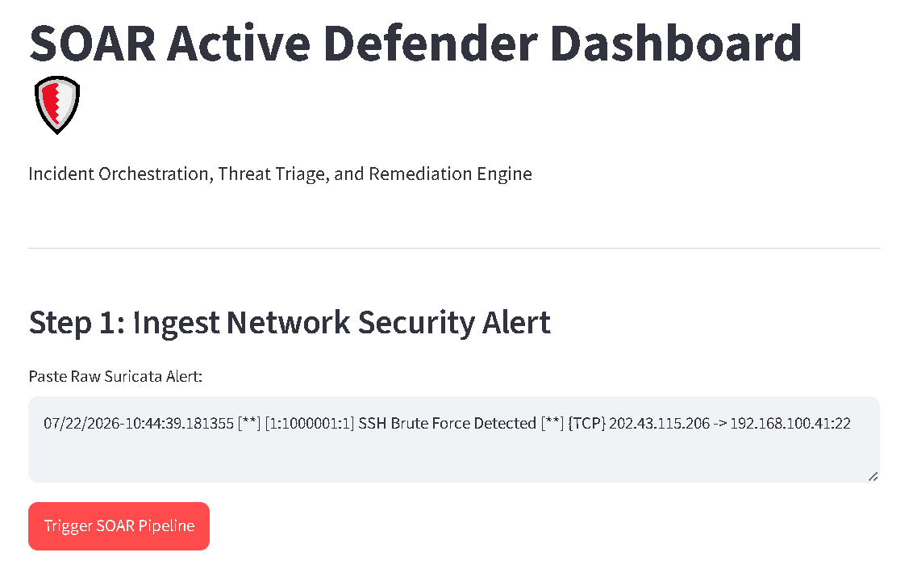
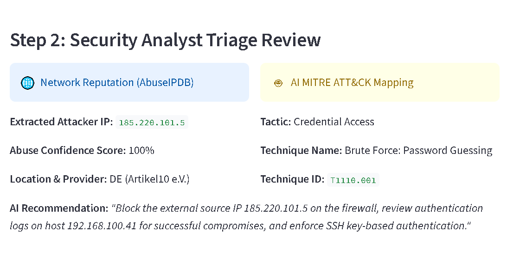
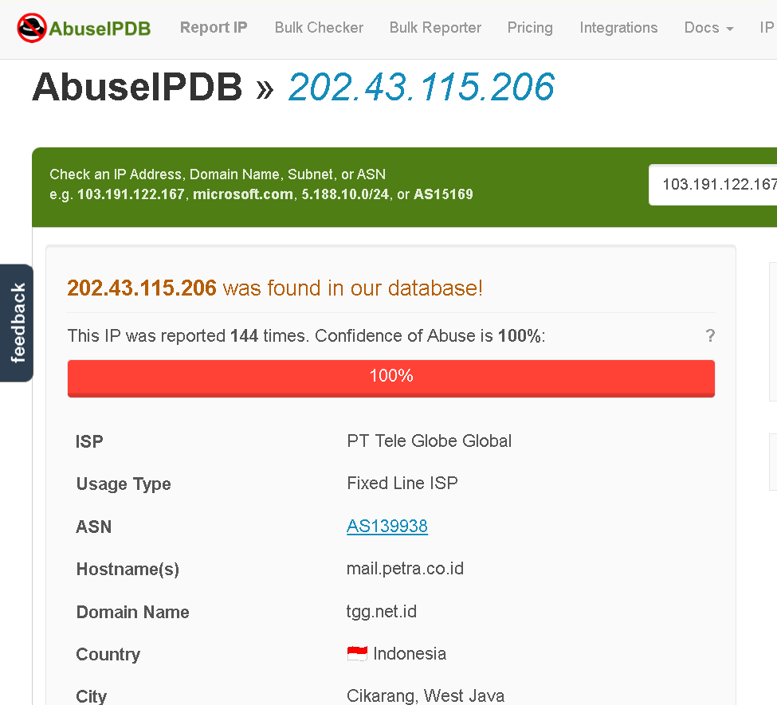
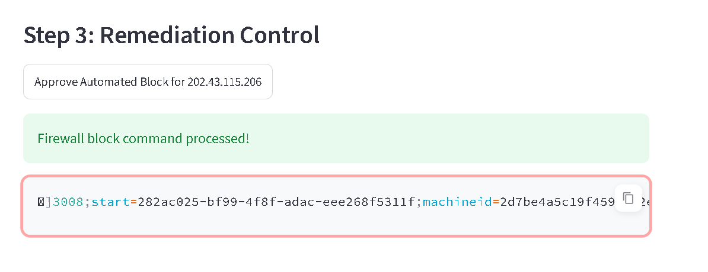
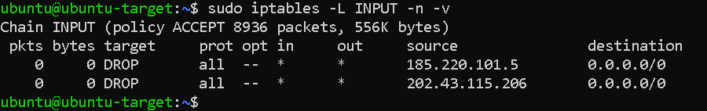

# Week 12: Full System Integration — The SOAR Grand Finale

## Objective
Refactor 12 weeks of standalone scripts into a modular, industry-structured SOAR (Security Orchestration, Automation, and Response) system — one orchestrator that parses a raw alert, enriches it with threat intelligence, classifies it via AI/MITRE ATT&CK, and remediates it automatically, all through a single dashboard.

---

## Environment

| Component | Detail |
|---|---|
| **Workstation** | WSL, Python virtual environment (`~/fastapi_project`) |
| **Backend** | FastAPI (`SOAR Active Defender API`, v4.0.0) |
| **Frontend** | Streamlit dashboard |
| **Modules** | `threat_check.py`, `firewall_test.py`, `ai_analyst.py`, `main.py`, `app.py` |

---

## Architecture — Modular Design

Twelve weeks of logic, previously scattered across standalone test scripts, consolidated into single-responsibility modules:

| File | Responsibility |
|---|---|
| `threat_check.py` | AbuseIPDB reputation lookup — isolated, reusable function |
| `firewall_test.py` | Netmiko SSH automation — duplicate-checked `iptables` blocking |
| `ai_analyst.py` | Gemini AI threat classification — structured MITRE ATT&CK mapping |
| `main.py` | FastAPI orchestrator — imports all modules, exposes two endpoints |
| `app.py` | Streamlit dashboard — the analyst-facing control surface |

---

## Key Implementation

**New capability — raw alert parsing.** Unlike previous weeks (which took a pre-extracted IP as input), the orchestrator now accepts a raw, unparsed Suricata alert string and extracts the attacker's IP itself:
```python
def extract_ip_from_text(text: str) -> str:
    ip_pattern = r'\b(?:[0-9]{1,3}\.){3}[0-9]{1,3}\b'
    ips = re.findall(ip_pattern, text)
    ...
    # filters out the target's own IP, localhost, and broadcast addresses
```

**Two orchestrated endpoints:**
- **`POST /analyze-alert`** — parses the raw alert, queries `get_abuse_score()`, runs `analyze_threat_with_ai()`, and returns a unified triage report (IP, abuse score, country, ISP, MITRE tactic/technique, suggested action)
- **`POST /remediate`** — takes the analyst-approved IP and calls `apply_firewall_block()` to execute the remote SSH block

**Dashboard workflow (`app.py`):** paste raw alert → "Trigger SOAR Pipeline" → review AI-enriched triage card → "Approve Automated Block" → live firewall confirmation — the entire detect-to-response loop, driven from one UI.

---

## System Walkthrough — End-to-End Execution

This section demonstrates the live operational flow of the SOAR pipeline, from raw alert ingestion to automated firewall enforcement.

### Step 1: Raw Alert Ingestion
The analyst pastes a raw, unparsed Suricata log containing the malicious IP (`202.43.115.206`) directly into the dashboard input surface and triggers the pipeline.


*Figure 1: Analyst-facing dashboard accepting a raw, unparsed Suricata network security log.*

---

### Step 2: Enriched Threat Triage & AI Analysis
The backend automatically extracts the IP, queries AbuseIPDB, and sends the payload to Google Gemini. The dashboard displays the threat score, provider details, and maps the attack to the corresponding MITRE ATT&CK Technique (T1110 — Brute Force).


*Figure 2: Real-time threat enrichment showing mapped MITRE ATT&CK metadata and generative AI incident response recommendations.*

To verify the accuracy of the threat intelligence pipeline, the data is validated against the official AbuseIPDB portal, which confirms the 100% abuse confidence score and ISP details for `202.43.115.206`.


*Figure 3: Live AbuseIPDB portal threat reputation confirmation matching the pipeline's findings.*

---

### Step 3: Analyst Approval & Remote Remediation
Upon reviewing the triage card, the analyst clicks "Approve Automated Block." This triggers a secure Netmiko SSH session to log into the remote target host, execute the duplicate-rule check, and append the firewall rule.


*Figure 4: Automated remote firewall command processed successfully, returning raw system execution logs.*

---

### Step 4: Live Firewall Verification
By logging directly into the target VM's terminal (hosted on the spare laptop), we run `iptables` to verify that the active packet-drop rule has been successfully appended to the active chain.


*Figure 5: Target VM terminal output confirming the active DROP rules for both the previous and newly mitigated attacker IPs.*

---
## Milestone
**End-to-end test:** pasted a raw Suricata alert containing a known malicious IP (`185.220.101.5`) into the dashboard. The system automatically:
1. Extracted the attacker IP via regex
2. Returned a live AbuseIPDB reputation score
3. Classified the alert as **MITRE T1110 (Brute Force)** via the Gemini AI analyst
4. On approval, executed the Netmiko SSH block and confirmed the rule via `sudo iptables -L INPUT -n -v` on the target VM

Twelve weeks of individual components — IDS, log parsing, threat intel, automation, AI classification, and a UI — now operate as a single closed-loop system.

---

## Key Learnings
- **Modularity isn't just tidiness — it's what makes orchestration possible.** Splitting logic into isolated, single-purpose files (`threat_check.py`, `firewall_test.py`, `ai_analyst.py`) meant `main.py` could import and coordinate them without any file needing to know how the others work internally. That separation is exactly what let three independently-built weeks (6, 7, and 10) combine into one pipeline with minimal glue code.
- **Regex-based extraction is a small addition with an outsized effect on usability.** Requiring a pre-extracted IP (as in earlier weeks) meant a human still had to read the alert first. Parsing the raw alert directly is what makes the dashboard genuinely usable by an analyst rather than just a developer testing an API.
- **This is the shape of a real SOAR tool, at a prototype scale.** Detection, enrichment, contextual classification, and response — with a human still in the loop for the final approval — mirrors the actual design pattern used in production security orchestration platforms, just built from first principles instead of a commercial SOAR product.
